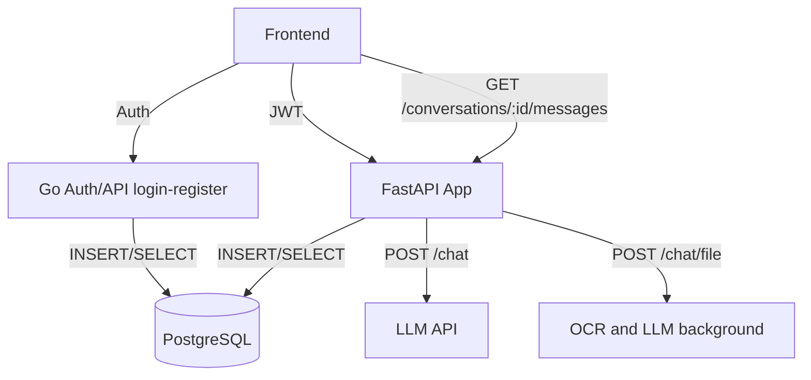

## Архитектура системы

### Сервисы

- **[FastAPI LLM Service](backend/llm_service/README.md)** - микросервис обработки запросов к LLM с поддержкой истории диалогов



### Поток 1: Простое сообщение

```
Клиент с валидным JWT вызывает POST /chat с текстом и conversation_id; FastAPI сохраняет user‑message в messages, синхронно вызывает LLM и сохраняет assistant‑message, после чего возвращает ответ и id созданного сообщения.
```

### Поток 2: Сообщение с файлами

```
Клиент вызывает POST /chat/file (multipart UploadFile) с conversation_id; FastAPI читает UploadFile, кладёт байты/временный путь, возвращает 202 Accepted с message_id, и запускает BackgroundTask: OCR → создать user‑message с распознанным текстом → вызвать LLM → создать assistant‑message
```

### Поток 3: История диалога

```
Клиент делает GET /conversations/:id/messages, FastAPI читает из PostgreSQL и возвращает постранично в порядке created_at, что позволяет фронту опрашивать прогресс файла после 202.
```

### Поток 4: Аутентификация

```
Клиент регистрируется/логинится в Go, который пишет/читает users и выдаёт JWT; этот токен используется в заголовке при запросах к FastAPI, где выполняется проверка подписи и авторизации.
```

### Поток 5: Как выдержать нагрузку

```
Делаем OCR/LLM в BackgroundTasks с быстрым ответом 202, чтобы воркеры не держали соединение и не занимали пул при долгих операциях, разгружая фронт от таймаутов.​

Храним UploadFile во временном файле или читаем bytes в обработчике и передаем путь/байты в BackgroundTask, потому что после ответа объект UploadFile может быть закрыт; это снижает ошибки и повторную работу.​

Масштабируем FastAPI горизонтально (несколько реплик под балансировщиком) и используем одну внешнюю PostgreSQL; фоновые задачи привязаны к каждому инстансу.
```
