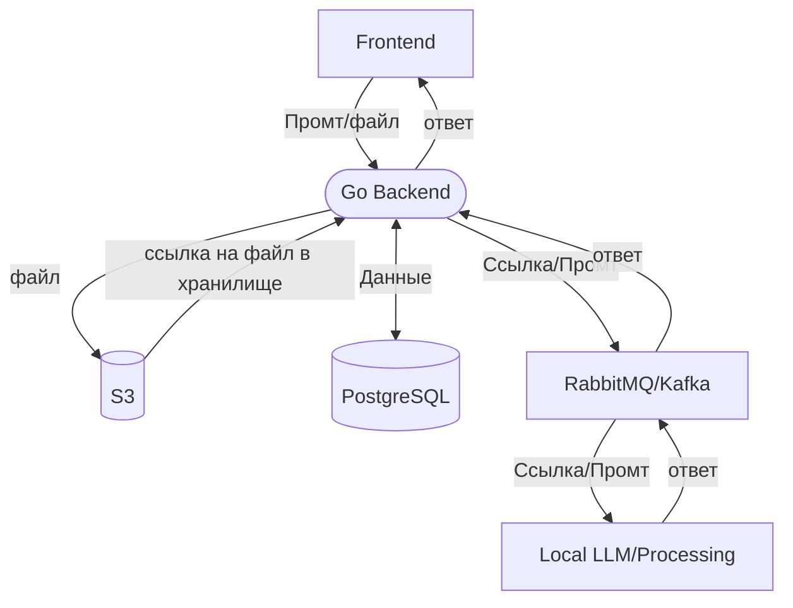

## Архитектура системы

```mermaid
graph TD
    A[Frontend] -->|Промт/файл| B([Go Backend])
    B --> |файл| F[(S3)]
    F --> |ссылка на файл в хранилище| B
    B <--> |Данные| C[(PostgreSQL)]
    B -->|Ссылка/Промт| D[RabbitMQ/Kafka]
    D --> |Ссылка/Промт| E[Local LLM/Processing]
    E-->|ответ|D
    D-->|ответ|B
    B-->|ответ|A
   
```