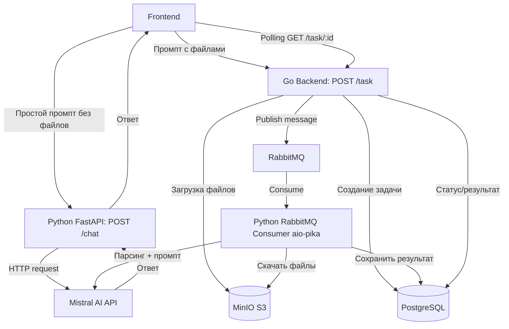

## Архитектура системы



### Поток 1: Простое сообщение

```
Frontend → Python FastAPI /chat → Mistral AI API → FastAPI → Frontend
```

### Поток 2: Сообщение с файлами

```
Frontend → Go /task → MinIO + PostgreSQL + RabbitMQ
                    ↓
          Python Consumer → Mistral AI API → PostgreSQL
                    ↓
Frontend ← Go /task/:id ← PostgreSQL (polling)
```
