## Архитектура системы

### Сервисы

- **[Frontend](frontend/README.md)** - Next.js веб-интерфейс для взаимодействия с AI
- **[FastAPI LLM Service](backend/llm_service/README.md)** - микросервис обработки запросов к LLM с поддержкой истории диалогов
- **[Нагрузочное тестирование LLM Service](backend/llm_service/perf/README.md)** - инструменты и документация для тестирования производительности LLM сервиса
- **[Go-Authentication ](backend/go/README.md)** - микросервис для авторизации
- **[Нагрузочное тестирование Go бекенда](backend/go/perf/README.md)** - инструменты и документация для тестирования производительности
- **PostgreSQL** - база данных для хранения диалогов и сообщений

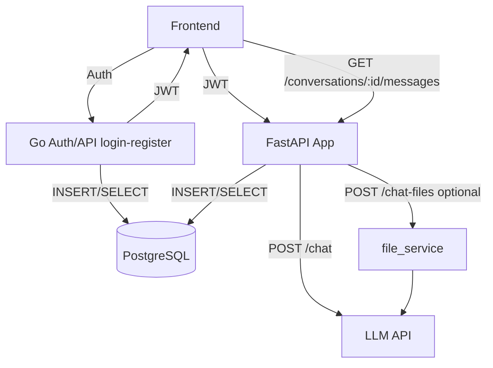

### Поток 1: Простое сообщение

```
Клиент с валидным JWT вызывает POST /chat с текстом и conversation_id; FastAPI сохраняет user‑message в messages, синхронно вызывает LLM и сохраняет assistant‑message, после чего возвращает ответ и id созданного сообщения.
```

### Поток 2: Сообщение с файлами

```
Клиент вызывает POST /chat (multipart form-data) с conversation_id и файлами; FastAPI валидирует расширения, извлекает текст (PDF/DOCX/TXT/MD), добавляет содержимое к сообщению и синхронно вызывает LLM. После получения ответа оба сообщения сохраняются в PostgreSQL и клиент получает готовый ответ.
```

### Поток 3: История диалога

```
Клиент делает GET /conversations/:id/messages, FastAPI читает из PostgreSQL и возвращает постранично в порядке created_at, что позволяет фронту опрашивать прогресс файла после 202.
```

### Поток 4: Аутентификация

```
Клиент регистрируется/логинится в Go, который пишет/читает users и выдаёт JWT; этот токен используется в заголовке при запросах к FastAPI, где выполняется проверка подписи и авторизации.
```

### Поток 5: Как выдержать нагрузку

```
OCR/LLM выполняются в основном обработчике /chat, поэтому важно контролировать размеры файлов и таймауты (ограничения настроены в FileService). При необходимости можно вынести обработку в фоновые задачи или очередь — код легко расширяется.

Перед обработкой файлы читаются в память и текст урезается до 50k символов, что защищает БД и LLM от перегруза. FastAPI можно масштабировать горизонтально под балансировщиком; все реплики используют общую PostgreSQL.
```

## Быстрый старт

### Запуск всей системы

```bash
# Клонировать репозиторий
git clone <repo-url>
cd copilot_alpha

# Создать .env файл
cp .env.example .env
# Заполнить переменные (MISTRAL_API_KEY и др.)

# Запустить все сервисы
make up
```

### Запуск через docker-compose напрямую

```bash
# Клонировать репозиторий
git clone <repo-url>
cd copilot_alpha

# Создать .env файл
cp .env.example .env
# Заполнить переменные (MISTRAL_API_KEY и др.)

# Поднять сервисы без make
docker-compose up --build
```

### Остановка docker-compose

```bash
docker-compose down
```

Сервисы будут доступны:

- **Frontend**: http://localhost:3000
- **FastAPI**: http://localhost:8000
- **Go-auth**: http://localhost:8080
- **PostgreSQL**: localhost:5432

### Остановка

```bash
make down
```

### Полный перезапуск (быстрый)

```bash
make reup
```

### Пересборка без кэша

```bash
make rebuild
```

## Переменные окружения

Создайте файл `.env` в корне проекта:

```env
# PostgreSQL
POSTGRES_USER=user
POSTGRES_PASSWORD=postgres
POSTGRES_DB=db

# FastAPI
DATABASE_URL=postgresql+asyncpg://user:postgres@db:5432/db
MISTRAL_API_KEY=your_mistral_api_key_here
MISTRAL_MODEL=mistral-small-latest

# Frontend
NEXT_PUBLIC_API_URL=http://localhost:8000

#Auth
JWT_SECRET=jwt_token
```

## Производительность системы

### Go Authentication Service

Результаты нагрузочного тестирования Go бекенда:

**Нагрузка** (300 пользователей, 300 сек, think_time=0.1 сек):

- **RPS**: 780 запросов/сек
- **Успешность**: 100% (234,627 успешных запросов из 234,627)
- **Среднее время отклика**: 0.35 сек
- **P95**: 1.44 сек, **P99**: 2.12 сек
- **Медианное время отклика**: 0.073 сек

**Детализация по эндпоинтам**:

- `POST /register` (300 запросов):

  - Среднее время: 1.71 сек
  - P95: 3.36 сек, P99: 4.10 сек
  - RPS: 1.0

- `POST /login` (75,631 запросов):

  - Среднее время: 0.90 сек
  - P95: 1.90 сек, P99: 2.54 сек
  - RPS: 251.5

- `GET /api/profile` (151,262 запросов):

  - Среднее время: 0.087 сек
  - P95: 0.35 сек, P99: 0.91 сек
  - RPS: 503.0

- `GET /health` (7,434 запросов):
  - Среднее время: 0.087 сек
  - P95: 0.40 сек, P99: 0.95 сек
  - RPS: 24.7

**Вывод**: Go бекенд стабильно обрабатывает до 780+ RPS без ошибок.

### FastAPI LLM Service

Результаты нагрузочного тестирования LLM сервиса (с мок-режимом для ответов LLM):

**Нагрузка** (300 пользователей, 300 сек, think_time=0.1 сек):

- **RPS**: 148 запросов/сек
- **Успешность**: 100% (45,031 успешных запросов из 45,031)
- **Среднее время отклика**: 1.94 сек
- **P95**: 3.79 сек, **P99**: 4.98 сек
- **Медианное время отклика**: 2.70 сек

**Детализация по эндпоинтам**:

- `POST /conversations` (6,342 запросов):

  - Среднее время: 0.76 сек
  - P95: 1.87 сек, P99: 8.20 сек
  - RPS: 20.8

- `POST /chat` (29,557 запросов):

  - Среднее время: 2.66 сек
  - P95: 3.95 сек, P99: 4.97 сек
  - RPS: 97.1

- `GET /conversations/{id}/messages` (6,042 запросов):

  - Среднее время: 0.61 сек
  - P95: 1.40 сек, P99: 2.13 сек
  - RPS: 19.9

- `GET /health` (3,090 запросов):

  - Среднее время: 0.052 сек
  - P95: 0.077 сек, P99: 0.099 сек
  - RPS: 10.2

**Вывод**: LLM сервис стабильно обрабатывает до 148+ RPS без ошибок.

## Демонстрация работы приложения

### Регистрация и авторизация

#### Незарегистрированный пользователь

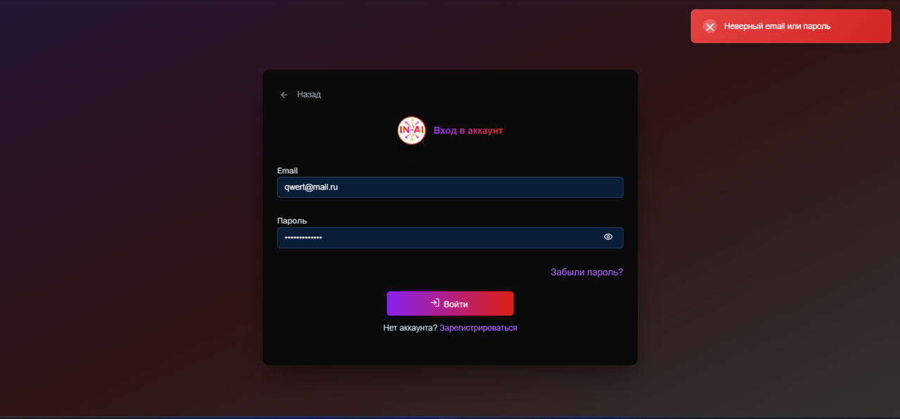

#### Несоответствие пароля требованиям

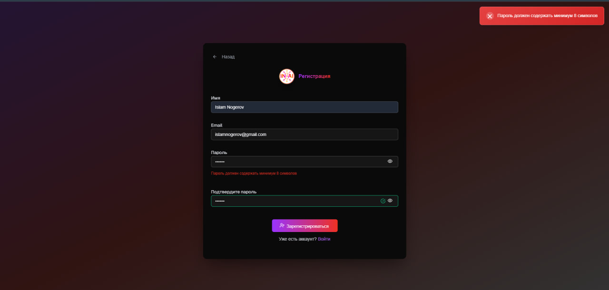

#### Ошибка подтверждения пароля

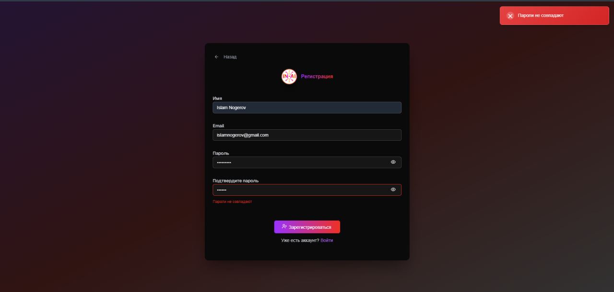

#### Неверный формат адреса электронной почты

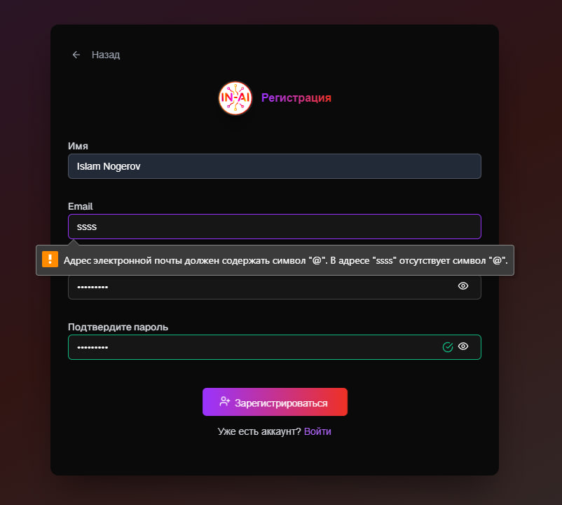

#### Отсутствие имени пользователя

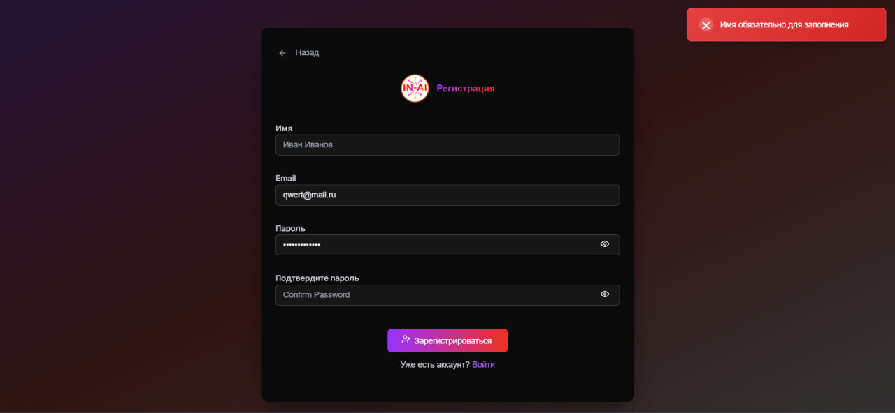

#### Успешная регистрация


#### Пустое поле адреса при восстановлении пароля

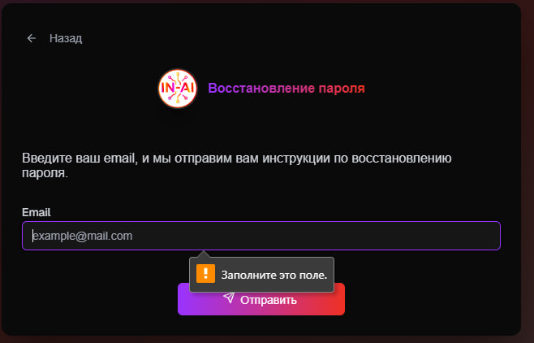

#### Отправка инструкции по восстановлению пароля

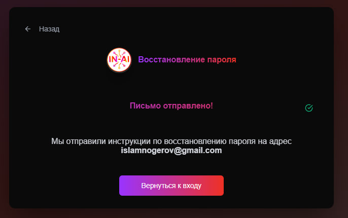

### Интерфейс чата

#### Окно чата

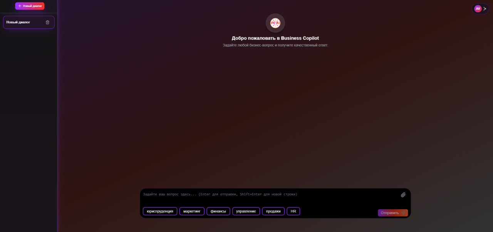

#### Попытка загрузить больше фалов, чем позволено

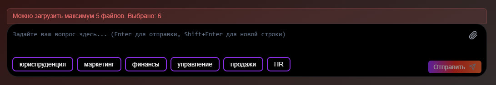

#### Ответ модели на простой вопрос без конкретной темы

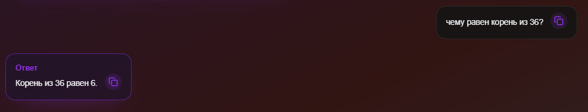

#### Считывание информации с PDF-файла и вывод запрашиваемого количества страниц

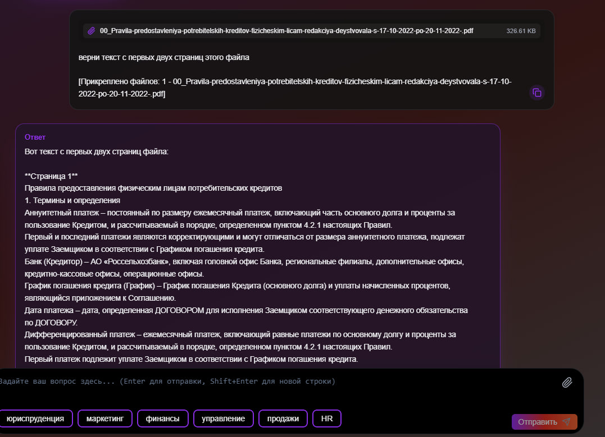

#### Копирование текста из ячеек чата

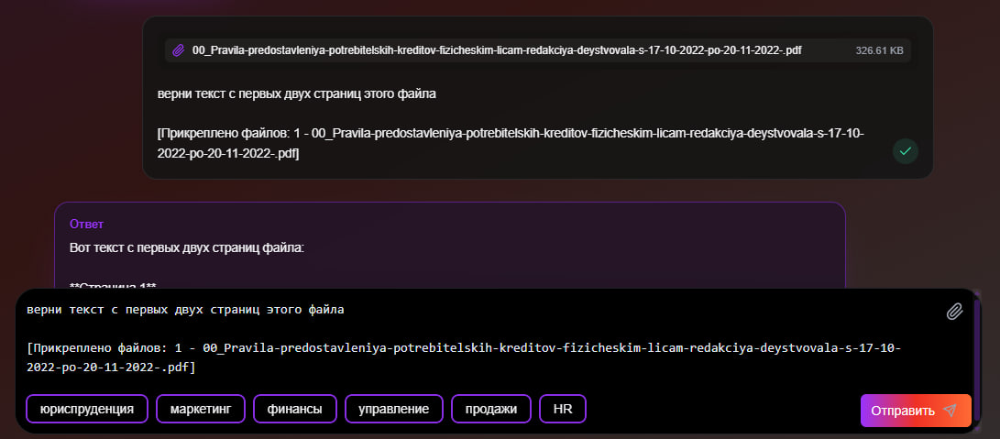

#### Переключение между светлой и тёмной темой

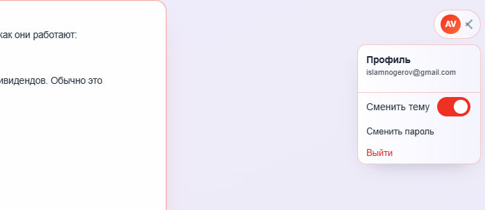
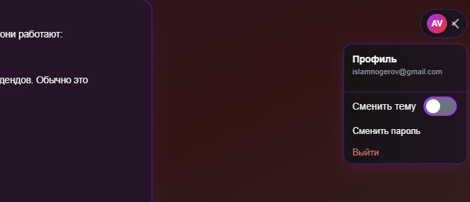

#### Ответ на более комплексный вопрос с выбранной темой

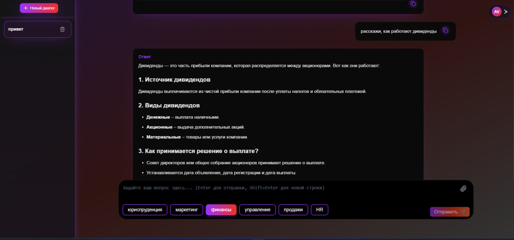

#### Удаление чатов

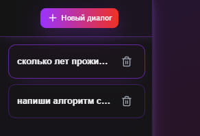


#### Окно смены пароля


#### Обработка некорректных данных при смене пароля

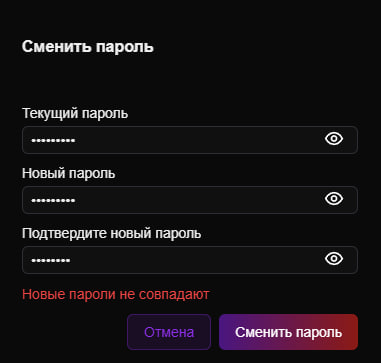
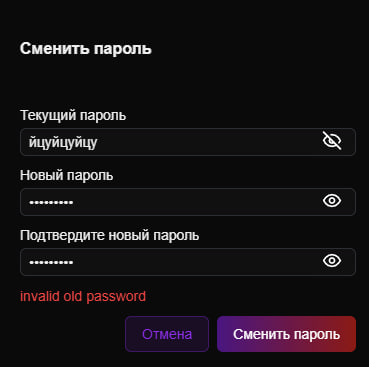

#### Успешная смена пароля


#### Ответ на слишком большие или бессмысленные сообщения

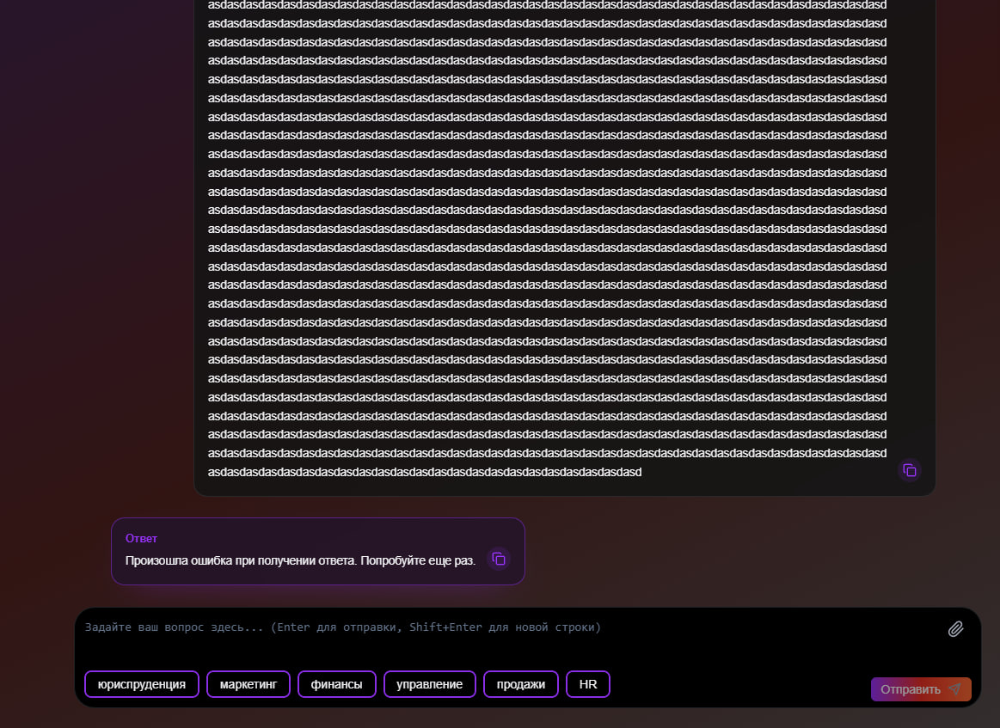
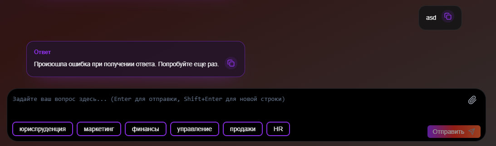

#### Попытка загрузки слишком большого файла

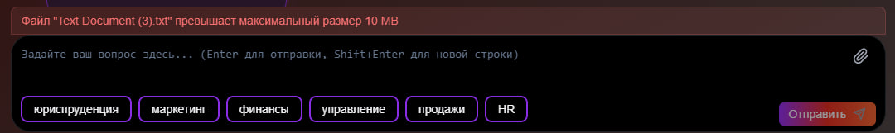

## Команда

| Роль     | Имя             | Контакт                                 |
| -------- | --------------- | --------------------------------------- |
| Техлид   | Алибеков Аслан  | [AlibekovAA](https://t.me/alibekov_05)  |
| Backend  | Василов Иван    | [VasilovIS](https://t.me/feof1l)        |
| Frontend | Беспалов Никита | [BespalovNV](https://t.me/Tyvmuteclown) |
| Аналитик | Ногеров Ислам   | [NogerovIA](https://t.me/mrsigint)      |
